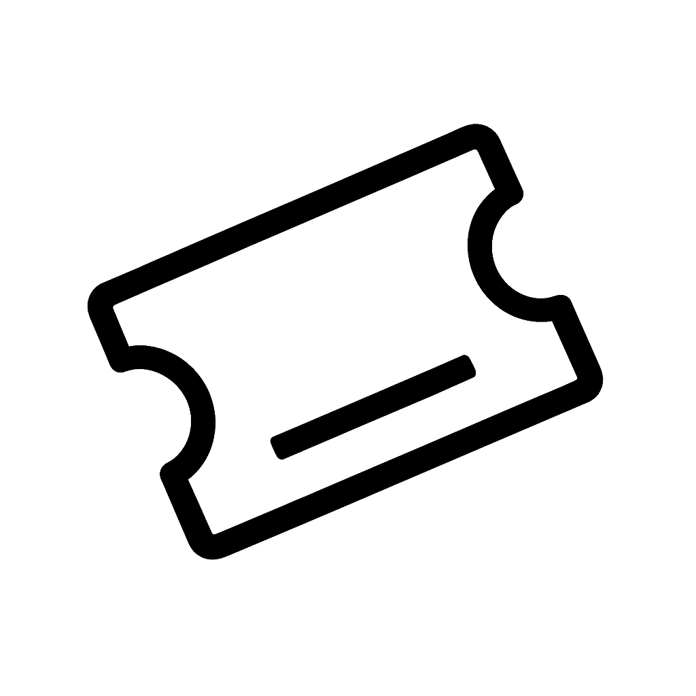

<h1 align="center"> Coupon Holder </h1> <br>

<p align="center">
	<a href="https://apps.apple.com/jp/app/coupon-holder/id6752533878">
		
	</a>
</p>

<p align="center">
	Never forget a coupon. Never miss a deal.
</p>

## Link
- [AppStore](https://apps.apple.com/jp/app/coupon-holder/id6752533878)
- [note](https://note.com/towa57035260/n/nc8c47dfac8e1?magazine_key=mf449bedc9207)

## Overview

Keep your coupons organized, track their expiration dates, and get reminded before they expire. Coupon Holder makes it easy to manage your coupons in one place, so you can use them before it's too late.

## Features

* 📸 **Easy Coupon Registration** — Register coupons by taking a photo and reduce the hassle of entering information manually.
* 📅 **Expiration Date Tracking** — Keep track of your coupons and quickly see which ones are expiring soon.
* 🔔 **Expiration Reminders** — Get notified when your coupons are approaching their expiration dates.
* 👀 **Expiration Status** — Easily distinguish between active, expiring soon, and expired coupons.
* 💾 **Local Data Storage** — Keep your coupon information stored on your device for quick and convenient access.
* 📱 **Native Swift App** — Built natively with Swift and SwiftUI for a smooth and responsive experience.

## Installation

```bash
# Clone repository
git clone https://github.com/keeki-fami/coupon.git
cd coupon

# Open in Xcode
open coupon.xcodeproj

# Build and run (⌘+R)
```

## Requirement

* iOS: 17.6+

## Feedback

Feedback is always welcome! Feel free to reach out to me by email or on X.

* Email : [keekiapp.feedback@gmail.com](mailto:keekiapp.feedback@gmail.com)
* X : [@Keeki_factory](https://x.com/keeki_factory?s=11)
